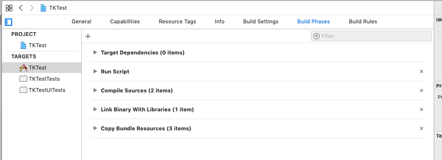

# 04 - Build automation

## Overview

* Add a build script to Xcode that will automatically run `cbindgen`, `cargo` and `lipo` when we build our app

## Instructions

There are a _lot_ of ways to do build systems. I've picked one simple solution that will work for our simple workshop project. Use whatever makes sense in your real-world projects.

Go to your app target in Xcode and choose **Build Phases**. Click the <b>+</b> (plus) button in the top-left and select **New Run Script Phase**. Drag the new **Run Script** entry from the bottom up to the second entry in the list. It should look like this:



Click the small triangle to the left to open the Run Script editor.

Set the **Shell** to: `/bin/bash`

Set the script to the following. Remember to change `RUST_PROJ` and `PATH` to suit your own system!

```bash
set -e
# Location of rust project
RUST_PROJ="/Users/tk/code/anvil"
# Location of the "Anvil" folder in the iOS project
IOS_ANVIL="$PROJECT_DIR/Anvil"
# Provide access to Rust utilities
PATH="$PATH:/Users/tk/.cargo/bin"

cd "$RUST_PROJ"
# Generate C bindings
cbindgen -l C -o target/anvil.h
# Build for iOS architectures
cargo build --target aarch64-apple-ios
cargo build --target x86_64-apple-ios
# Combine them into a universal library
lipo -create target/aarch64-apple-ios/debug/libanvil.a target/x86_64-apple-ios/debug/libanvil.a -output target/libanvil.a
# Copy resources to the iOS folder, overwriting old ones
cp target/anvil.h target/libanvil.a "$IOS_ANVIL"
```

Go back to your Rust project and modify `src/lib.rs` to do something obviously different. For example:

```rust
#[no_mangle]
pub extern "C" fn hello_devworld() {
    println!("Hi there! This is a new message.");
}
```

No need to do anything at the terminal! Now when you run the app on the simulator in Xcode, it should automatically compile and use the latest version of your Rust library.

## Exercises

### 1. Compilation errors

First introduce a minor mistake to your Rust code, like forgetting the `!` in `println!()`:

```rust
    println("Hi there! This is a new message.");
```

(If you replaced this in the `ferris_says` exercise, leave off the `b` before the string in `b"Hello..."`)

What happens when you try to run the app in Xcode? Can you identify the problem and fix it?

Next try something a bit nastier: add an extra `}` on the first line of the function:

```rust
pub extern "C" fn hello_devworld() {}
    println!("Hi there! This is a new message.");
}
```

Try building and running now. Can you identify the error inside Xcode? Try running `cargo check` or `cargo build` on the terminal.

Is there some way you could improve the supplied build script so that you get a higher quality error in Xcode?

### 2. Support for release builds

You might have noticed that the script always does Debug builds. If you're familiar with bash scripting, try to update the build script to detect Xcode's build configuration and do the same thing for the Rust code. ([Hint](https://stackoverflow.com/questions/890569/xcode-variables))
