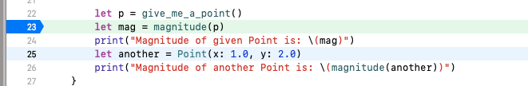

# 05 - Primitives, structs, enums

## Overview

* Explore the documentation for C numeric types
* Define structs in Rust that you can use from Swift
* Define enums in Rust that you can use from Swift

## Instructions

Normally Rust uses primitive data types with names like `bool`, `i32`, and `usize`. If you're not used to them, have a quick look at the tables on the [data types page of the Rust book](https://doc.rust-lang.org/book/ch03-02-data-types.html).

To make sure our header file comes out the way we expect we've been using types with names like `c_int`. These come from the `std::os::raw` module, which is part of the Rust standard library. Have a look at the [full list of C types](https://doc.rust-lang.org/std/os/raw/index.html). Click on some of them to see how they are defined.

To continue our exploration, add some more code to `src/lib.rs`:

```rust
#[repr(C)]
pub struct Point {
    pub x: c_float,
    pub y: c_float,
}

#[no_mangle]
pub extern "C" fn give_me_a_point() -> Point {
    Point {
        x: 3.14,
        y: 12.0,
    }
}

#[no_mangle]
pub extern "C" fn magnitude(p: Point) -> c_float {
    (p.x * p.x + p.y * p.y).sqrt()
}
```

Build your app so that Swift picks up the new functions, then use it in inside `viewDidLoad()`. Try something like this:

```swift
        let p = give_me_a_point()
        let mag = magnitude(p)
        print("Magnitude of given Point is: \(mag)")
        let another = Point(x: 1.0, y: 2.0)
        print("Magnitude of another Point is: \(magnitude(another))")
```

Place a breakpoint in this code and step through in the debugger. You should be able to inspect the values of `p` and `another` like any other struct.



Next, add an enum to `src/lib.rs`.

```rust
#[repr(C)]
pub enum TrafficLight {
    Red,
    Yellow,
    Green, 
}

#[no_mangle]
pub extern "C" fn what_colour() -> TrafficLight {
    TrafficLight::Green
}
```

Try using it from Swift:

```swift
        let colour = what_colour()
        if colour == Green {
            print("go")
        } else {
            print("stop")
        }
```

## Exercises

### 1. Prove that structs are copied

Add this function to your Rust code. It adds 1.0 to the `x` field of the provided `Point`, then returns it.

```rust
#[no_mangle]
pub extern "C" fn add_one(mut p: Point) -> Point {
    p.x += 1.0;
    p
}
```

In Swift, create a `Point`, provide it to the function, then store the return value in a second `Point`. Use the debugger or print statements to show that Rust did not affect the value of the `Point` that you passed in - it was working on a copy.

### 2. Experiment with enum representation

`cbindgen` has a lot of options that customise the way your header file is generated. Maybe you don't like having the bare name `Green`, as above.

Have a look at the [user guide](https://github.com/eqrion/cbindgen/blob/master/docs.md) - in particular, search for the `rename_variants` option. Try to create a `cbindgen.toml` configuration file that changes the way enum values are represented. You can use it like this.

<pre>$ <b>cbindgen --config cbindgen.toml -l C -o target/anvil.h</b></pre>

(Personally I'm a fan of "qualified screaming snake case", mostly because of the name.)
