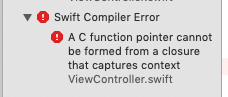

# 07 - Swift callbacks

## Overview

* Call back to Swift synchronously
* Call back to Swift asynchronously
* Return a value from a Swift callback

## Instructions

Apple's APIs often have functions that accept a closure as an argument. Either now or later it will run the code you supplied in the closure.

First let's make a variation of the `add_numbers` function that invokes a callback with the result. This is the Swift code we want to write. (You can add it to `ViewController.swift` now. Once we fill in the Rust function it will compile.)

```swift
print("Adding numbers with callback...")
add_numbers_cb(4, 5) {
    answer in
    print("The answer is \(answer)")
}
print("Finished adding numbers!")
```

Add the corresponding function to `lib.rs` in the `anvil` project.

```rust
#[no_mangle]
pub extern "C" fn add_numbers_cb(n1: c_int, n2: c_int, callback: fn(c_int)) {
    let answer = n1 + n2;
    callback(answer);
}
```

Here, `fn` means a function pointer. In Rust code you will more commonly see `Fn`, which supports Rust closures, but on the C interface we have to make do with lower-case `fn`. Thus the third parameter to `add_numbers_cb` is a function that takes an `int` argument and returns `void`.

By the way, the Rust equivalent of `void` is the empty tuple: `()`.

With both the Swift and Rust code in place, build and run the app. It should produce the following output. Notice that our Swift closure is run _during_ the call to the Rust function. Its printout comes between the two other `print` statements.

```
Adding numbers with callback...
The answer is 9
Finished adding numbers!
```

The Rust code doesn't necessarily need to call the closure right away - it could be delayed. Let's create a function that runs the countdown before we launch a rocket. We will call it from `ViewController.swift` like this:

```swift
countdown() {
    (timer: Int32) in
    if timer > 0 {
        print("\(timer) seconds to go...")
    } else {
        print("Houston we have liftoff")
    }
}
```

This time we expect our closure to be called once per second until the timer gets to zero.

Add the corresponding Rust:

```rust
use std::thread;
use std::time::Duration;

#[no_mangle]
pub extern "C" fn countdown(callback: fn(c_int)) {
    // Moving the callback fn ptr into the thread
    thread::spawn(move || {
        for x in (0..=15).rev() {
            thread::sleep(Duration::from_secs(1));
            callback(x);
        }
    });
}
```

Here we spawn a new thead from Rust that is responsible for firing the callback every second. You may notice that the iOS app is not busy or frozen while the countdown is happening. The `countdown()` function itself returns immediately.

Imagine our Swift code notices a problem and we need to abort the countdown. How could we do that? Let's return an enum from our closure that indicates whether the countdown should proceed or not.

On the Rust side, we will change the type of `callback` so that it returns `CountdownCommand` enum value. Then when we call the callback, we will then `match` on the return value to see whether it was `Continue` or `Abort`.

```rust
#[repr(C)]
pub enum CountdownCommand {
    Continue,
    Abort,
}

#[no_mangle]
pub extern "C" fn countdown(callback: fn(c_int) -> CountdownCommand) {
    // Moving the callback fn ptr into the thread
    thread::spawn(move || {
        for x in (0..=15).rev() {
            thread::sleep(Duration::from_secs(1));
            match callback(x) {
                CountdownCommand::Continue => continue,
                CountdownCommand::Abort => break,
            }
        }
    });
}
```

The Swift code will normally return `Continue`, but it can also return `Abort`. (If you fiddled with your `cbindgen.toml` in an earlier exercise, your enum values may have different names.)

```swift
countdown() {
    (timer: Int32) in
    
    // Uh oh
    if timer == 7 {
        print("Aborting!")
        return Abort
    }
    
    if timer > 0 {
        print("\(timer) seconds to go...")
    } else {
        print("Houston we have liftoff")
    }
    return Continue
}
```

## Exercises

### 1. Background the app

While the countdown is running, background the app. If you're using a Simulator you can press the Home button under the "Hardware" menu.

What happens to the Rust thread and the countdown?

### 2. Non-static closures

**Warning:** This is not really a fair exercise. There are solutions. Some of them better than others. It's a complicated problem and exploring it is outside the scope of this workshop.

Imagine your `ViewController` is also responsible for a big display that shows the countdown. It has a function like this:

```swift
    func updateDisplay(timer: Int32) {
        // ...
    }
```

Now you try to update it from your countdown closure:

```swift
        countdown() {
            (timer: Int32) in
            if timer > 0 {
                print("\(timer) seconds to go...")
                self.updateDisplay(timer: timer)
            } else {
                print("Houston we have liftoff")
            }
            return Continue
        }
```

You get this strange compilation error:



How can you call a method on your `ViewController` from inside this closure?


